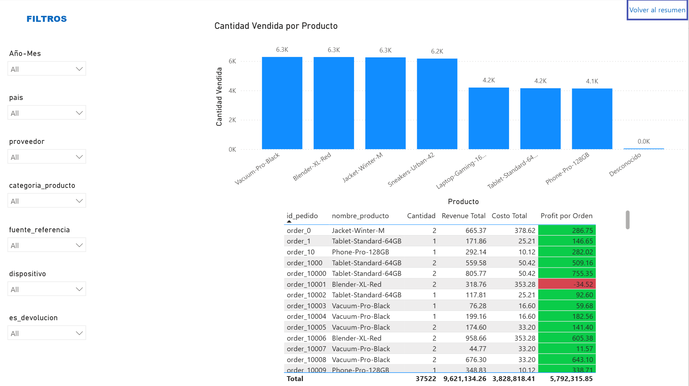
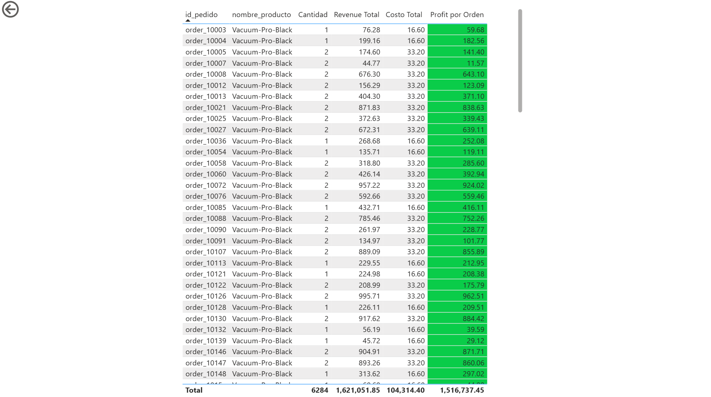

# Dashboard Rappiplus — Rentabilidad y Comportamiento de Ventas

Dashboard construido en Power BI a partir de tres datasets (`orders`, `catalog`, `marketing`) limpiados previamente con un pipeline propio en Python/pandas. Cubre el periodo **enero-junio 2025**.

## Modelo de datos

Esquema de estrella con las siguientes tablas:

- **`Dim_Fecha`** — tabla de dimensión de fechas, marcada como "Date Table" en el modelo.
- **`orders_clean`** — tabla de hechos principal (pedidos), 24,940 filas.
- **`catalog_clean`** — dimensión de productos, 7 filas.
- **`marketing_clean`** — hechos de inversión en marketing, sin relación física en el modelo (se conecta vía `TREATAS` en DAX para respetar filtros de fecha y país sin generar ambigüedad de relaciones muchos-a-muchos).

**Relaciones activas:**
- `Dim_Fecha[Date]` → `orders_clean[fecha_hora_pedido]` (1 a muchos, dirección única)
- `catalog_clean[nombre_producto]` → `orders_clean[nombre_producto]` (1 a muchos, dirección única)

---

## Página 1 — Resumen Ejecutivo

Vista general orientada a un ejecutivo: salud del negocio en un vistazo, sin necesidad de explorar el detalle.

### Título y navegación
- Título "Resumen ejecutivo Rappiplus Ene-Jun 2025" en la parte superior.
- Slicer de `Año-Mes` para filtrar el periodo.
- Botón "Ver Análisis detallado" que navega a la página de Detalle / Drill-through.

### Tarjetas KPI
Cinco tarjetas con las métricas principales del negocio:
- **Revenue Total** — suma de `monto_total`, ya neto de devoluciones (las devoluciones tienen `cantidad` y `monto_total` negativos, calculados previamente en pandas y marcados con la columna `es_devolucion`).
- **Profit Total** — Revenue menos costo de producto menos inversión en marketing.
- **Gasto Marketing** — inversión total, sumada directo de `marketing_clean`.
- **Ticket Promedio** — revenue promedio por orden.
- **Prom. unidades** — cantidad promedio de productos por orden.

Construidas con medidas DAX documentadas con comentarios (`Revenue Total`, `Costo Total`, `Gasto Marketing`, `Profit Total`, `Ticket Promedio`, `Cantidad Promedio por Orden`).

### Evolución mensual: revenue vs profit

Gráfico de líneas con `Dim_Fecha[Año-Mes]` en el eje X y `Revenue Total` / `Profit Total` como valores. Requirió dos ajustes:
- Cambiar el eje de `Date` (nivel día) a `Año-Mes` (nivel mes), para evitar ruido visual de cientos de puntos diarios.
- Corregir el orden cronológico del eje con una columna auxiliar `Orden Mes` (`YEAR * 100 + MONTH`) vinculada vía "Sort by column", ya que `Año-Mes` es texto y se ordenaba alfabéticamente por defecto.

### Revenue y Profit YTD

Gráfico de líneas acumulado, usando `TOTALYTD()` sobre `Revenue Total` y `Profit Total`. Como el dataset cubre solo enero-junio 2025 (medio año, sin datos de años anteriores), el acumulado de junio equivale al total del periodo completo.

### Revenue y Profit por categoría de producto

Gráfico de barras agrupadas por `orders_clean[categoria_producto]`. Usa la medida `Profit Bruto por Producto` (Revenue menos Costo, **sin** restar Gasto Marketing) en vez de `Profit Total`, porque `marketing_clean` no tiene ninguna columna de producto/categoría con la cual prorratear el gasto de forma real — forzar esa relación habría distorsionado el número.

### Revenue y Profit por país

Gráfico de barras agrupadas por `orders_clean[pais]`, usando `Revenue Total` y `Profit Total` (sí incluye marketing, a diferencia del gráfico por categoría). Esto fue posible porque `marketing_clean` sí tiene una columna `pais` con el mismo formato que `orders_clean[pais]`, así que `Gasto Marketing` se corrigió para usar `TREATAS` doble (fecha y país simultáneamente), permitiendo que el filtro cruzado funcione correctamente en ambas dimensiones sin crear una relación física.

---

## Página 2 — Detalle / Drill-through

Vista de exploración: permite ir del KPI general a cada orden o producto individual.

### Panel de filtros (lateral izquierdo)
Slicers para: `Año-Mes`, `pais`, `proveedor`, `categoria_producto`, `fuente_referencia`, `dispositivo`, `es_devolucion`.

### Cantidad Vendida por Producto
Gráfico de barras con `orders_clean[nombre_producto]` en el eje X y la medida `Cantidad Vendida` (`SUM(orders_clean[cantidad])`), ordenado de mayor a menor. Sirve como punto de entrada al drill-through: clic derecho sobre cualquier barra → Drill through → Detalle de Producto.

### Tabla detallada de órdenes
Columnas: `id_pedido`, `nombre_producto`, `cantidad`, `Revenue Total`, `Costo Total`, `Profit por Orden`.

Usa la medida `Profit por Orden` (Revenue menos Costo, sin marketing) en vez de `Profit Total`, ya que esta última no está diseñada para comportarse correctamente a nivel de fila individual dentro de una tabla desglosada por pedido.

**Formato condicional** en la columna `Profit por Orden`: fondo verde si el valor es ≥ 0, fondo rojo si es negativo — visible en pedidos con devolución (ej. `order_10001`, con profit de -34.52).

Botón "Volver al resumen" para regresar a la Página 1.

---

## Página 3 — Detalle de Producto (drill-through)

Página de destino del drill-through, configurada con `orders_clean[nombre_producto]` como campo de drill-through. Al llegar desde el gráfico "Cantidad Vendida por Producto" de la Página 2, esta tabla se filtra automáticamente al producto seleccionado (ejemplo en la imagen: `Vacuum-Pro-Black`, 6,284 unidades totales, coincidiendo exacto con el valor del gráfico de origen).

Incluye:
- Botón de regreso (flecha) en la esquina superior izquierda, generado automáticamente por Power BI.
- Misma tabla de detalle que en la Página 2 (mismas columnas y formato condicional), ya filtrada.
- Título dinámico (medida `Titulo Drillthrough`, usando `SELECTEDVALUE`) que muestra "Detalle de: [producto seleccionado]" para confirmar el contexto al usuario.

---

## Medidas DAX principales

| Medida | Descripción |
|---|---|
| `Revenue Total` | Suma de `monto_total`, neto de devoluciones |
| `Costo Total` | `SUMX` de cantidad × costo_unitario, vía relación con `catalog_clean` |
| `Gasto Marketing` | Suma de `gasto`, con `TREATAS` doble (fecha y país) para respetar filtros sin relación física |
| `Profit Total` | Revenue − Costo − Marketing |
| `Profit Bruto por Producto` | Revenue − Costo, sin marketing (para desgloses por categoría/producto) |
| `Profit por Orden` | Revenue − Costo, sin marketing (para la tabla de detalle a nivel de fila) |
| `Ticket Promedio` | Promedio de `monto_total` por orden |
| `Cantidad Promedio por Orden` | Promedio de `cantidad` por orden |
| `Margen Profit %` | Profit Total / Revenue Total |
| `Revenue YTD` / `Profit YTD` | Acumulado desde inicio de año con `TOTALYTD` |
| `Cantidad Vendida` | Suma de `cantidad`, para el gráfico de barras por producto |
| `Titulo Drillthrough` | Texto dinámico con el producto filtrado en la página de drill-through |
